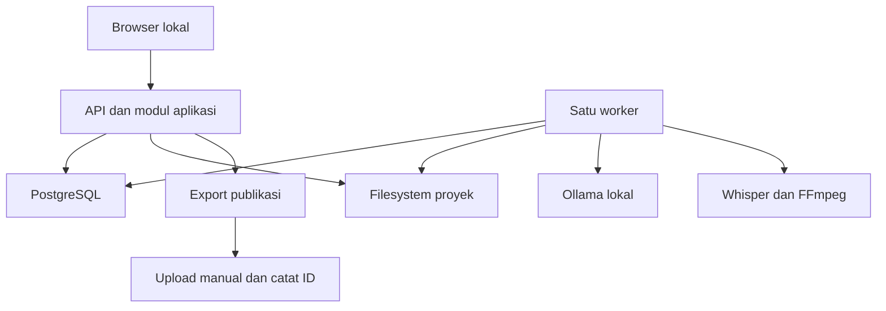

# Local AI Content Studio

**Product Requirements Document v0.7**  
**Tanggal:** 15 September 2026  
**Status:** Baseline eksekusi yang diusulkan; belum ada validasi pasar atau benchmark pada PC pengguna.  
**Menggantikan:** PRD v0.6. Kemampuan jangka panjang tetap dipertahankan dalam roadmap.  
**Strategi:** Validate → Build → Publish → Measure → Learn → Automate → Scale.

Tujuan produk adalah membangun bisnis konten original yang menghasilkan laba, sambil mengembangkan sistem produksi lokal milik sendiri menggunakan software open source dan model lokal dengan izin penggunaan yang sesuai. Tahap validasi menggunakan perangkat yang sudah dimiliki dan anggaran tambahan Rp0 untuk software, API, aset, hosting, dan hardware.

Setiap pekerjaan development harus membantu menerbitkan video berikutnya, mengukur hasilnya, mengurangi pekerjaan berulang yang sudah terlihat, atau menjaga data produksi agar dapat dipakai kembali.

## 1. Keputusan utama v0.7

| Area | Keputusan awal |
| --- | --- |
| Pelanggan pertama | Satu channel YouTube milik sendiri; satu operator |
| Audiens | Developer pemula dan pekerja teknis Indonesia yang ingin memakai AI lokal serta mengotomasi pekerjaan dokumen atau file |
| Bahasa | Bahasa Indonesia; istilah teknis dijelaskan dengan contoh |
| Janji editorial | Menunjukkan satu pekerjaan nyata, cara mengerjakannya, hasil pengujian, serta keterbatasannya |
| Format | Faceless demo/explainer, 5–8 menit, 1080p, 16:9, 30 FPS |
| Visual utama | Rekaman layar sendiri, diagram sederhana, hasil eksperimen, dan teks pendukung |
| Jadwal awal | Satu video per minggu setelah pilot; maksimal 8 jam kerja manusia per minggu |
| Pendapatan pertama yang diuji | Paket template/workflow praktis yang diturunkan dari demonstrasi channel |
| Pendapatan berikutnya | Iklan YouTube setelah memenuhi ketentuan; affiliate relevan, sponsor, atau layanan hanya ketika ada bukti permintaan |
| Frontend | Browser lokal: React + TypeScript + Vite |
| Backend dan data | .NET 10 modular monolith, PostgreSQL, filesystem lokal |
| AI teks awal | Ollama lokal + Qwen3-8B terkuantisasi; benchmark sebelum penggunaan rutin |
| Narasi pilot | Rekaman suara operator menggunakan perangkat yang sudah ada |
| Subtitle | faster-whisper dengan model multilingual small sebagai baseline; koreksi manual |
| Rendering | FFmpeg berdasarkan scene manifest tervalidasi |
| Publishing MVP | Export paket publikasi, upload manual melalui YouTube Studio, lalu simpan video ID |
| Pengukuran MVP | Input metrik manual; integrasi API bertahap setelah produksi berulang |
| Infrastruktur ditunda | RabbitMQ, Valkey, pgvector, SearXNG, image generation, dan scheduler kompleks |

Pilihan audiens, format, jadwal, harga uji, dan ambang evaluasi dalam dokumen ini adalah hipotesis operasional. Pilihan tersebut belum membuktikan demand atau menjamin profit. Nama channel dan desain logo boleh memakai versi kerja sederhana; keduanya tidak menghambat pilot.

## 2. Product vision dan batas kepemilikan

Studio membantu operator menemukan peluang, memeriksa sumber, membuat angle dan script, mengelola aset, menyiapkan narasi dan subtitle, merender video, melakukan QA, menerbitkan, serta mempelajari hasil produksi.

Channel sendiri menjadi bisnis pertama dan tempat menguji nilai software. Productization atau SaaS baru dipertimbangkan setelah manfaat produksi dan ekonomi dapat diulang.

Ekosistem sendiri berarti operator mengendalikan source code aplikasi, konfigurasi, prompt, data penelitian yang boleh disimpan, aset yang berhak digunakan, proyek produksi, hasil render, dan catatan pembelajaran. Model serta aset pihak ketiga tetap digunakan sesuai lisensinya; tidak diklaim sebagai hak milik eksklusif studio.

YouTube tetap menjadi ketergantungan distribusi. Mesin produksi harus tetap bisa menghasilkan file lokal ketika layanan distribusi tidak tersedia. Pencarian dan pengambilan aset baru memerlukan jaringan; produksi dari bahan yang sudah tersedia dapat berjalan offline setelah instalasi dan pengunduhan model.

## 3. Kontrak anggaran Rp0

Anggaran tambahan sebelum validasi adalah Rp0 untuk langganan, penggunaan API berbayar, pembelian aset, sewa server, domain, iklan berbayar, serta hardware baru. PC, sambungan internet, dan perangkat rekam yang sudah dimiliki menjadi prasyarat. Ketersediaan RAM, ruang disk, sistem operasi, dan perangkat rekam harus diinventarisasi saat setup.

Listrik bukan nol. Pemakaian disk, umur perangkat, internet yang sudah dibayar, serta waktu operator tetap dicatat agar hasil ekonomi tidak terlihat lebih baik dari kenyataan. Jika Rp0 dimaknai tanpa tambahan konsumsi listrik sama sekali, produksi lokal tidak memenuhi definisi tersebut.

Persyaratan wajib:

- Provider AI yang aktif hanya endpoint lokal; model cloud dan fallback berbayar dinonaktifkan.
- Free trial, kredit promosi, atau paket gratis yang wajib berubah menjadi langganan tidak menjadi ketergantungan inti.
- Provider aset harus dapat dipakai tanpa pembelian; limit, syarat penggunaan, dan hak penyimpanan tetap dihormati.
- Kuota habis atau provider gagal menghasilkan status menunggu, penggunaan bahan lokal, atau tindakan manual. Sistem tidak mengganti provider ke layanan berbayar.
- Tidak membeli hardware untuk mengejar benchmark. Kurangi model, context, resolusi preview, atau scope produksi terlebih dahulu.
- Biaya transaksi penjualan boleh dipotong dari hasil penjualan jika tidak menuntut modal di muka; seluruh potongan dicatat.
- Mengubah anggaran Rp0 memerlukan keputusan baru dari pemilik. Roadmap tidak memberikan izin belanja otomatis.

Gunakan mode lokal Ollama, termasuk `OLLAMA_NO_CLOUD=1` pada versi yang mendukungnya, dan verifikasi bahwa provider aplikasi tidak mengarah ke layanan cloud. Ini adalah kontrol tambahan di samping allowlist endpoint aplikasi. [Dokumentasi mode lokal Ollama](https://docs.ollama.com/faq#how-do-i-disable-ollama-cloud-features)

## 4. Prinsip open source dan pemilihan model

Software open source, bobot model terbuka, data pelatihan terbuka, aset gratis, dan izin komersial merupakan atribut berbeda. Registry mencatat masing-masing tanpa memberi label seluruh stack sebagai sepenuhnya terbuka bila sebagian informasi tidak tersedia.

Komponen produksi harus memiliki lisensi yang mengizinkan penggunaan yang dimaksud. Persyaratan atribusi, distribusi, dan penggunaan output dicatat bila berlaku. Model berlabel non-commercial atau research-only tidak masuk pipeline monetisasi. Source code runtime yang terbuka tidak otomatis membuat semua checkpoint atau voice di dalamnya memenuhi kebutuhan.

Keputusan model awal:

| Komponen | Pilihan | Status dan alasan |
| --- | --- | --- |
| Teks | Qwen/Qwen3-8B melalui Ollama, kuantisasi Q4_K_M sebagai kandidat awal | Model card mencantumkan Apache-2.0; ukuran dan context tetap diuji di perangkat aktual |
| Transkripsi | faster-whisper + model Whisper multilingual small | Mulai dari konfigurasi kecil untuk subtitle; verifikasi paket, checkpoint, dan hasil bahasa Indonesia |
| Narasi Indonesia | Rekaman operator | Jalur pilot yang langsung dapat dinilai kualitas dan hak penggunaannya |
| TTS Indonesia | Adapter disiapkan dalam desain; tidak ada voice otomatis yang diaktifkan pada pilot | Aktivasi hanya setelah bukti lisensi dan uji kualitas pada materi channel |
| TTS Inggris | Kokoro-82M sebagai kandidat apabila bahasa Inggris kelak diuji | Tidak dijadikan baseline Indonesia |
| Gambar AI | Ditunda | Rekaman dan diagram sudah mencukupi untuk hipotesis format awal |
| Embeddings | Ditunda | Pencarian metadata dipakai sampai keterbatasannya terbukti |

Qwen3-8B dipilih sebagai baseline yang dapat diuji, bukan klaim bahwa ia model terbaik secara umum. Model card mencantumkan Apache-2.0. [Model card Qwen3-8B](https://huggingface.co/Qwen/Qwen3-8B)

faster-whisper menyediakan transkripsi dengan timestamp kata; kecocokan teks dan timing tetap diperiksa. [Dokumentasi faster-whisper](https://github.com/SYSTRAN/faster-whisper#word-level-timestamps)

Kokoro-82M tidak mencantumkan bahasa Indonesia pada daftar voice yang diperiksa. Voice Piper `id_ID/news_tts/medium` memiliki model card yang merujuk lisensi dataset ke URL lain; informasi itu belum cukup untuk mengesahkan seluruh jalur penggunaan voice dalam PRD ini. Tidak ada klaim bahwa voice tersebut pasti terlarang; statusnya belum disetujui untuk baseline. [Voice Kokoro](https://huggingface.co/hexgrad/Kokoro-82M/blob/main/VOICES.md), [model card voice Piper Indonesia](https://huggingface.co/rhasspy/piper-voices/blob/main/id/id_ID/news_tts/medium/MODEL_CARD)

`MODEL_REGISTRY.md` saat implementasi harus mencatat repository/model ID, revision atau digest aktual, kuantisasi, lisensi runtime, lisensi weights/voice, batas penggunaan, sumber ketentuan, tanggal pemeriksaan, kebutuhan resource terukur, dan keputusan aktivasi. Jangan mengarang hash atau benchmark pada tahap PRD.

## 5. Hipotesis channel dan validasi demand

Hipotesis utama: penonton awal menginginkan demonstrasi berbahasa Indonesia yang membantu mereka menyelesaikan pekerjaan dengan AI lokal tanpa biaya langganan. Kemampuan operator dalam software menjadi dasar pengujian, penjelasan, dan pembuatan aset original.

Fokus awal pada tiga seri yang berdekatan:

| Seri | Contoh masalah | Bukti yang harus ditampilkan |
| --- | --- | --- |
| Mulai AI lokal | Menyiapkan model pada PC sendiri | Setup aktual, kebutuhan perangkat terukur, satu tugas berhasil dan satu keterbatasan |
| Otomasi dokumen/file | Meringkas dokumen, mengelompokkan file, membuat draft terstruktur | Input buatan sendiri, hasil, kesalahan, dan koreksi |
| Uji manfaat | Membandingkan dua workflow lokal untuk tugas yang sama | Kondisi uji, durasi, kualitas hasil, dan penjelasan tradeoff |

Tidak memakai data, credential, screenshot, atau kode internal pekerjaan tanpa hak penggunaan. Demonstrasi memakai proyek pribadi atau data sintetis.

Sebelum video pertama, buat daftar lima kandidat topik. Untuk setiap kandidat simpan satu masalah penonton, setidaknya dua observasi demand yang dapat diperiksa, kontribusi original, estimasi effort, dan contoh jalur manfaat. Observasi boleh berupa pertanyaan publik atau pola hasil pencarian; bukan angka volume pencarian yang dikarang AI.

Lakukan review singkat maksimal 90 menit. Jika bukti demand masih tipis, labeli sebagai eksperimen eksploratif dengan batas effort kecil. Produksi tidak menunggu pembangunan Trend Engine.

Pilih topik dengan kombinasi relevansi audiens, kemampuan menunjukkan hasil sendiri, effort rendah, dan kedekatan dengan masalah yang mungkin layak dijadikan template. Skor bantuan AI bersifat editorial; bukan probabilitas viral atau profit.

## 6. Konten pilot dan packaging

Pilot terpilih: **“AI lokal tanpa langganan: saya uji untuk merangkum dokumen bahasa Indonesia.”** Judul final harus mencerminkan hasil eksperimen, termasuk bila kualitasnya terbatas.

Materi pilot memakai satu dokumen contoh buatan sendiri, satu prompt awal, satu perbaikan prompt, dan hasil yang dibandingkan dengan fakta dokumen. Jika setup model belum stabil, kecilkan panjang input dan ruang lingkup uji; jangan mengganti hasil dengan demonstrasi palsu.

Struktur awal 5–8 menit:

1. Tunjukkan masalah dan cuplikan hasil yang nyata.
2. Jelaskan perangkat dan batas pengujian secara singkat.
3. Tampilkan langkah dan hasil utama.
4. Perlihatkan kesalahan atau bagian yang perlu diperiksa manusia.
5. Jelaskan kapan workflow berguna, lalu ajak penonton mencoba bahan contoh atau menyebut kebutuhan berikutnya.

Sebelum merekam, siapkan tiga kandidat judul, dua konsep thumbnail, dan satu kalimat manfaat. Pilih satu pasangan yang sesuai isi. Simpan versi judul/thumbnail yang benar-benar diterbitkan beserta waktu perubahannya. Tidak membangun mesin A/B testing untuk kebutuhan ini.

Gunakan rekaman layar yang terbaca di ponsel, zoom pada langkah penting, diagram sederhana, dan narasi yang jelas. Musik latar tidak wajib. Thumbnail cukup berupa hasil nyata dan teks pendek yang terbaca; desain logo tidak menjadi pekerjaan utama pilot.

## 7. Hipotesis pendapatan pertama

Pendapatan pertama yang diuji adalah **paket template/workflow otomasi lokal**, misalnya kumpulan prompt teruji, contoh input, konfigurasi, langkah troubleshooting, dan script milik sendiri yang berkaitan dengan video.

Alasan pemilihan: hasil kerja dapat digunakan ulang, relevan dengan demonstrasi, tidak memerlukan model berbayar, dan tidak menuntut pembangunan SaaS. Penonton membayar kelengkapan serta kemudahan penggunaan yang sudah diuji. Informasi dasar video tetap berguna tanpa membeli.

Urutan eksperimen:

1. Video awal menyediakan satu contoh sederhana dan meminta feedback tentang pekerjaan yang ingin diotomasi.
2. Catat permintaan spesifik dari penonton nyata; jangan menganggap likes atau jawaban AI sebagai minat beli.
3. Setelah ada sedikitnya tiga permintaan relevan dari orang berbeda, atau bukti lain yang dicatat jelas, tawarkan satu konsep paket dan harga uji **Rp49.000**. Angka ini adalah keputusan eksperimen, bukan hasil riset harga pasar.
4. Pengemasan versi pertama dibatasi empat jam dan menggunakan materi yang sudah dibuat. Jangan membuat fitur baru yang besar hanya untuk penawaran pertama.
5. Sebelum penjualan dibuka, paket harus tersedia, isi dan batas dukungannya jelas, serta metode pembayaran dan pengiriman dapat dipakai tanpa biaya awal. Untuk uji kecil dapat memakai kanal transaksi yang sudah dimiliki; sistem studio cukup mencatat transaksi secara manual.
6. Target bukti awal: tiga pembeli independen dengan pembayaran aktual dan feedback penggunaan. Satu transaksi belum membuktikan bisnis yang berulang.

Tidak memakai proyeksi pendapatan iklan sebelum ada data yang relevan. Affiliate hanya diuji untuk produk yang memang digunakan dan relevan; setiap potongan, komisi, refund, serta biaya dukungan dicatat. Sponsorship, layanan implementasi, dan produk studio adalah opsi masa depan yang tidak wajib untuk validasi awal.

## 8. Ukuran hasil dan definisi profit

Keberhasilan dibagi menjadi tiga:

| Tingkat | Definition of success |
| --- | --- |
| Teknis | Satu proyek dapat menghasilkan video tervalidasi, diekspor, diterbitkan, dan dihubungkan dengan video ID |
| Operasional | Lima publikasi dapat diulang; waktu manusia, kegagalan, dan rework tercatat |
| Bisnis | Ada penerimaan nyata; surplus kas dan hasil per total jam kerja memenuhi target yang disepakati dalam dokumen ini |

Gunakan basis kas untuk validasi awal:

```text
Pendapatan kas bersih
= penerimaan aktual - refund - potongan transaksi/platform

Surplus kas operasional
= pendapatan kas bersih - pengeluaran operasional aktual

Surplus kas per total jam manusia
= surplus kas operasional / seluruh jam kerja studio pada periode yang sama

Estimasi laba ekonomis
= surplus kas operasional - nilai waktu manusia
  - penyusutan/porsi pemakaian perangkat dan fasilitas yang belum dihitung
```

Jangan mengurangi biaya yang sudah masuk potongan transaksi dua kali. Pendapatan YouTube yang masih berupa estimasi dicatat terpisah dari payout; keduanya tidak dijumlahkan sebagai dua penerimaan.

Pisahkan jam research, script, rekam, edit/review, publishing, distribusi, support, development, dan maintenance. Tampilkan efisiensi produksi per video serta hasil bisnis per seluruh jam kerja. Jam setup awal tetap terlihat dalam kumulatif usaha meskipun tidak dibebankan seluruhnya pada satu video.

Target bisnis awal yang dipilih: surplus kas positif selama tiga bulan berturut-turut, disertai surplus kas minimal **Rp50.000 per total jam manusia** pada periode tersebut. Nilai per jam adalah patokan internal yang dapat direvisi dengan alasan tercatat, bukan asumsi tentang penghasilan operator atau pasar. Laba ekonomis dan saldo kumulatif sejak awal tetap dilaporkan terpisah; surplus bulanan tidak berarti seluruh investasi waktu sudah kembali.

Sebelum ada revenue, gunakan watch time per jam produksi, perubahan waktu kerja, performa pada umur video yang sama, dan jumlah feedback/permintaan relevan. Views, subscriber, dan watch time adalah indikator pembelajaran, bukan profit.

## 9. Batas waktu dan aturan alokasi kerja

Batas default adalah delapan jam manusia per minggu untuk seluruh usaha. Render atau inference unattended dicatat sebagai machine time; waktu menunggu aktif dan menangani kegagalan masuk jam manusia.

Target pilot adalah terbit dalam tiga minggu sejak kickoff, dengan timebox development sebelum pilot maksimal 12 jam. Target ini merupakan batas pengambilan keputusan, bukan jaminan estimasi implementasi. Jika aplikasi belum siap, gunakan tools lokal dan proses manual lalu simpan bahan serta metrik dalam format yang dapat diimpor.

Setelah pilot, alokasikan sekitar enam jam untuk konten, review audience, dan penawaran; maksimal dua jam untuk perbaikan software. Hambatan yang benar-benar memblokir publikasi boleh mengubah pembagian minggu tersebut dengan alasan dicatat. Kekurangan waktu direspons dengan mengecilkan konten, bukan menaikkan batas kerja diam-diam.

Sebuah fitur baru diprioritaskan jika hambatannya sudah muncul pada sedikitnya dua produksi, atau merupakan kebutuhan minimum untuk hasil yang dapat dipakai. Estimasi manfaat harus menyebut menit kerja yang dapat dihemat dan berapa kali fitur akan dipakai.

## 10. Tahap delivery dan scope

| Tahap | Hasil wajib | Boleh manual | Belum diperlukan |
| --- | --- | --- | --- |
| P0 — Pilot | Video pertama terbit, aset/sumber tersimpan, waktu dan biaya dicatat | Research, voice, render command, upload, metrik | Aplikasi lengkap dan integrasi API |
| P1 — MVP studio | Browser dapat mengelola satu proyek, memakai AI lokal, merender manifest, meninjau hasil, dan mencatat publikasi | Rekam layar/suara, pencarian sumber, upload, input metrik | Queue broker, cache eksternal, vector search |
| P2 — Produksi berulang | Lima video dan evaluasi hambatan yang dapat dibandingkan | Pekerjaan yang belum menjadi bottleneck | Autonomous strategy dan multi-channel |
| P3 — Validasi bisnis | Satu penawaran kecil, ledger pendapatan/biaya, serta keputusan lanjut/pivot berdasarkan bukti | Penjualan dan fulfilment sederhana | Billing engine dan storefront sendiri |

Kemampuan wajib pada P1: project CRUD, brief, sumber/claim, versioned script, approval, import aset lokal, metadata lisensi, import narasi, subtitle yang dapat diperbaiki, scene manifest, render job, technical QA, review final, export, video ID, metrik dasar, time/cost log, dan export/import proyek.

Di luar P1: TTS Indonesia otomatis, API upload, bulk analytics sync, Pexels/Pixabay adapter, SearXNG, semantic search, generative image/video/music, advanced motion graphics/3D, editor timeline kompleks, browser automation publikasi, ML prediction, fine-tuning, competitor intelligence otomatis, multi-channel, SaaS, multi-tenancy, billing, Kubernetes, dan distributed GPU.

Yang ditunda tetap berada dalam roadmap; tidak menjadi dependency tersembunyi backlog P1.

## 11. Workflow dan tiga approval

Urutan kerja: brief dan observasi peluang → riset → pilihan angle → approval ide → outline dan script → approval script → rekaman/asset planning → narasi/subtitle → scene manifest → render → QA → approval final → export/publish → metrik → review.

| Checkpoint | Keputusan manusia | Bukti tersimpan |
| --- | --- | --- |
| A1 — Ide | Masalah penonton, bukti awal, nilai original, dan effort layak | Versi brief/angle, alasan memilih, waktu approval |
| A2 — Script | Fakta, janji judul, langkah demo, CTA, dan visual utama sesuai | Versi script dan klaim yang diperiksa |
| A3 — Final | Video, audio, subtitle, hak aset, metadata, dan disclosure siap publikasi | Hash render, versi metadata, hasil review, waktu approval |

Perubahan script yang memengaruhi narasi atau klaim membatalkan approval terkait dan output turunannya. Perubahan video atau metadata substansial setelah A3 memerlukan review ulang. Job yang gagal tidak menghapus approval atas input yang belum berubah.

State content: Draft, Researching, IdeaReview, Scripting, ScriptReview, Producing, FinalReview, ReadyToPublish, Published, Archived. Status job terpisah dari status content. Transisi gagal menampilkan tindakan pemulihan, bukan memaksa operator mengulang seluruh proyek.

## 12. Antarmuka browser

P1 memakai tiga area sederhana:

| Area | Isi |
| --- | --- |
| Projects | Daftar, status, tindakan berikutnya, dan ringkasan waktu |
| Project detail | Tab Brief/Research, Script, Assets/Audio, Production/Review, Publish/Metrics |
| Settings | Lokasi data, model lokal, batas job, template, dan export/backup |

Editor script adalah teks terstruktur. Scene dapat ditambah, diurutkan, dan diubah durasinya lewat form sederhana; tidak membuat editor video setara aplikasi profesional. Operator bisa preview output dan memperbaiki satu scene tanpa membuat ulang aset yang tidak berubah.

UI menampilkan pekerjaan yang berjalan, tahap yang gagal, alasan kegagalan, retry/cancel, dan file hasil. Ringkasan biaya membedakan Rp0 biaya provider dari estimasi penggunaan listrik dan waktu.

## 13. Arsitektur awal

Gunakan modular monolith .NET 10 dengan batas modul Content, Research, AI, Assets, Production, Publishing, dan Measurement. Modul memanggil interface internal. Pemisahan proses dilakukan untuk runtime AI dan media yang membutuhkan resource atau dependency berbeda, bukan memecah setiap modul menjadi microservice.



Worker menarik job dari tabel PostgreSQL. Pada P1 boleh di-host sebagai BackgroundService pada aplikasi; host terpisah dapat diperkenalkan jika lifecycle atau pemakaian resource membutuhkannya. Data persisten tidak bergantung pada queue in-memory.

Organisasi source yang disarankan: `src/AIStudio.Api`, `src/AIStudio.Web`, `src/AIStudio.Application`, `src/AIStudio.Domain`, `src/AIStudio.Infrastructure`, serta `media/` untuk runner Python/media. Batas Application/Domain/Infrastructure dapat dimulai sebagai folder lalu dipisah menjadi project ketika membantu pekerjaan. `docs/` memuat PRD, keputusan arsitektur, model registry, dan runbook.

Tidak ada kewajiban Docker Desktop. Development dapat memakai instalasi lokal atau runtime container yang tersedia dan sesuai lisensi. OS yang ada dipertahankan; WSL2/Linux hanya dipilih saat implementasi bila diperlukan untuk menjalankan stack tanpa pembelian tambahan.

## 14. AI Gateway dan research

Semua generasi teks melalui `IAiTextGenerator`. Implementasi pertama hanya provider Ollama lokal. Request menyertakan tugas, versi prompt, model digest, batas token/context, timeout, dan schema output bila diperlukan.

Gateway wajib menyimpan status, durasi, model, versi prompt, serta referensi input/output proyek. Jangan menyimpan credential atau data sensitif ke log. Maksimal dua retry untuk kegagalan sementara; validasi output yang terus gagal berakhir pada edit manual. Tidak membuat loop agent tanpa batas.

Riset P1 menerima URL, catatan, kutipan singkat, atau bahan yang dimasukkan operator. Browser/search dipakai manual; SearXNG bukan dependency video pertama. Halaman dan snippet diperlakukan sebagai bahan yang perlu diperiksa, bukan instruksi untuk sistem.

Setiap klaim penting menyimpan sumber pendukung, lokasi bukti bila ada, tanggal akses, status Verifiable/NeedsReview/Unsupported, serta catatan reviewer. Satu klaim boleh mempunyai lebih dari satu sumber. Confidence model tidak menggantikan evidence.

Simpan materi sumber secukupnya dan sesuai hak penggunaan. Bila halaman tidak dapat diakses, tandai keterbatasan; jangan membuat isi atau kutipan palsu. Script factual final memerlukan sumber atau demonstrasi yang dapat diperiksa operator.

## 15. Model data minimum

Mulai dari tabel yang dipakai pipeline, dengan beberapa detail fleksibel di JSONB. Tidak semua atribut Content Genome harus menjadi kolom terpisah.

| Entity | Data utama |
| --- | --- |
| Content | ID, topic, audience, language, angle, format, status, created/published time |
| ResearchSource | Content ID, URL, title, accessed/published time, catatan bukti |
| ResearchClaim | Content ID, statement, source references, verification status |
| ScriptVersion | Content ID, version, hook, body/sections, CTA, claim references, approval |
| Asset | Provider/source, author, file hash, relative path, media properties, license evidence |
| AssetUsage | Asset ID, project/scene reference, crop/time range, attribution requirements |
| RenderManifest | Schema version, script version, scene data, asset hashes, renderer config |
| Approval | Type, input version/hash, decision, reviewer, timestamp, note |
| Job | Type, status, input version, attempts, lease, output, error |
| Publication | Platform, video ID/URL, metadata version, publication time, approval reference |
| MetricObservation | Scope, metric, date/window, value, unit, source, fetched time, availability |
| TimeEntry | Content/period, category, human minutes, note |
| CostEntry | Category, period/content, amount, currency, actual/estimated, method |
| RevenueEntry | Source, offer/content attribution, gross/net, fees, refunds, paid/estimated, currency |
| ExperimentNote | Hypothesis, change, comparison window, observation, limitation, next action |

Gunakan relasi banyak-ke-banyak sederhana atau reference list yang tervalidasi untuk klaim/sumber dan aset/proyek. File besar tidak disimpan sebagai blob PostgreSQL.

## 16. Asset Hunter v0 dan hak penggunaan

Asset Hunter tetap menjadi kemampuan inti, dimulai dari inventaris lokal, filter jenis/resolusi/durasi, pencarian judul/tag, dan pemilihan manual. Urutan kebutuhan visual: rekaman sendiri atau diagram → aset lokal yang sesuai → provider gratis yang disetujui → AI generation setelah layak.

Interface konseptual: `IAssetProvider.Search`, `GetMetadata`, `Download`, dan `Validate`. Implementasi P1 adalah LocalAssetProvider. Pexels menjadi kandidat provider eksternal pertama jika kebutuhan stock footage berulang sudah terlihat; implementasinya perlu pemeriksaan dokumentasi dan syarat provider saat itu. Pixabay dan penyedia lain menyusul bila menutup gap nyata.

Hak penggunaan merupakan filter wajib sebelum ranking. Asset dapat berstatus OwnCreated, ApprovedWithConditions, NeedsReview, atau Rejected. Aset dengan status NeedsReview/Rejected tidak boleh lolos QA publikasi. Review manusia hanya boleh mengubah status dengan evidence baru, bukan sekadar menekan bypass.

Metadata minimum: source URL, provider asset ID bila ada, author, jenis lisensi, license URL/evidence, tanggal pemeriksaan, attribution text, batas penggunaan, local relative path, SHA-256, ukuran, resolusi, durasi, dan hubungan pemakaian. Catat hak atas musik dan voice secara terpisah. Rekaman sendiri juga diperiksa agar tidak menampilkan bahan pihak ketiga yang tidak berhak digunakan.

Scoring otomatis ditunda. Jika dibangun, hanya kandidat eligible yang diberi nilai: relevansi 50%, kualitas 20%, orientasi/resolusi 15%, dan kecocokan durasi 15%. Bobot tersebut heuristik internal, bukan ukuran keamanan lisensi.

Unduh hanya kandidat yang dipilih, batasi ukuran file, deduplikasi dengan hash, dan ikuti batas caching/download provider. Tidak melakukan bulk mirroring sebagai default.

## 17. Narasi, musik, dan subtitle

Pilot memakai narasi sendiri dengan mikrofon atau perangkat yang sudah ada. Rekam per bagian, gunakan script yang telah disetujui, lalu bersihkan gangguan dasar dan sesuaikan level audio. Faceless berarti wajah tidak harus tampil; penggunaan suara sendiri tetap sesuai format.

TTS tetap menjadi target otomasi. Adapter `INarrationProvider` dirancang agar audio rekaman dan audio generasi menghasilkan metadata yang sama. Jangan membangun adapter TTS sebelum ada voice yang disetujui. Seleksi berikutnya dibatasi sesi benchmark singkat pada materi channel dan tidak menghambat jadwal publikasi.

Uji voice calon pada angka, nama software, singkatan, kalimat Indonesia, serta campuran istilah Inggris. Operator menilai kejelasan dan kealamian, mengukur waktu koreksi, serta memeriksa izin voice/model. Voice diterima hanya bila kualitas memadai dan total waktu kerja lebih kecil dari metode rekaman.

Subtitle menggunakan transkripsi audio aktual lalu dicocokkan dengan script; teks narasi yang salah tidak boleh dikunci hanya karena hasil ASR. P1 mendukung subtitle tingkat kalimat dan edit timestamp. Word highlighting serta forced alignment khusus ditunda sampai dibutuhkan.

Musik tidak wajib. Bila digunakan, pilih koleksi lokal kecil dengan lisensi yang sesuai, simpan atribusi, dan jaga agar narasi tetap terdengar. Tidak memakai scraping musik atau model generasi musik yang hak komersialnya belum jelas.

## 18. Production engine dan scene manifest

Pipeline: approved script → rekaman/demo dan kebutuhan visual → aset eligible → narasi → subtitle → manifest tervalidasi → FFmpeg → technical QA → human review.

AI boleh menyarankan urutan scene, caption, atau visual. Aplikasi membatasi output pada schema; LLM tidak menghasilkan shell command yang langsung dieksekusi. Durasi final diturunkan dari audio dan pilihan editing, bukan semata estimasi jumlah kata.

Contoh kontrak yang dapat diimplementasikan:

```json
{
  "schemaVersion": "1.0",
  "contentId": "content-demo-001",
  "scriptVersion": 2,
  "output": { "width": 1920, "height": 1080, "fps": 30 },
  "narrationAssetId": "audio-001",
  "subtitleAssetId": "subs-001",
  "scenes": [
    {
      "id": "scene-001",
      "startSeconds": 0,
      "durationSeconds": 8,
      "visualType": "screen_recording",
      "assetId": "screen-001",
      "sourceInSeconds": 2,
      "caption": "Periksa hasil ringkasan dengan dokumen asli"
    }
  ]
}
```

Contoh hanya menggambarkan satu scene; bukan video pilot lengkap. Validator memeriksa urutan, durasi positif, gap/overlap yang tidak disengaja, aset yang ada, rentang sumber, layout, dan kecocokan total audio/video.

P1 mendukung potong, susun, crop/scale, caption, subtitle, still image, dan transisi sederhana. Motion graphics, 3D, dan Blender tidak diwajibkan. Jika kelak berguna, Blender headless atau tool lain boleh dihubungkan sebagai renderer tambahan setelah evaluasi lisensi dan effort.

Output utama MP4, H.264, audio AAC; preview dapat memakai resolusi lebih rendah. Simpan manifest, input hashes, versi FFmpeg, font, parameter, dan metadata model. Target reproducibility adalah hasil yang setara secara fungsi dan visual pada lingkungan yang dikunci; tidak menjanjikan bit-identical lintas GPU atau versi encoder.

## 19. QA dan originalitas

| Pemeriksaan | P1 otomatis | Review manusia |
| --- | --- | --- |
| Integritas file | File terbaca, stream audio/video ada, decode tidak gagal | Preview normal |
| Format | Resolusi, FPS, durasi, codec sesuai target | Teks terbaca dan crop masuk akal |
| Audio | Level/clipping dan bagian tanpa audio yang mencurigakan | Suara jelas, istilah benar, musik tidak mengganggu |
| Subtitle | Timestamp valid, tidak melewati durasi, tidak ada teks kosong tak disengaja | Teks benar dan timing nyaman |
| Aset | File/hash tersedia dan status hak eligible | Visual cocok dengan narasi dan kondisi pemakaian terpenuhi |
| Fakta | Klaim membutuhkan reference/status verifikasi | Demonstrasi dan pernyataan benar |
| Originalitas | Kelengkapan evidence dan catatan kontribusi | Nilai original, repetisi, dan mutu penjelasan |
| Publikasi | A3 mengacu output serta metadata terbaru | Judul/thumbnail jujur dan disclosure sesuai |

Status QA: Pass, Warning, atau Fail. Fail teknis kritis, aset tanpa izin yang sesuai, atau klaim utama tidak terdukung memblokir ReadyToPublish. Warning memerlukan catatan keputusan manusia. Ambang numerik audio/silence dikalibrasi dari pilot, bukan dianggap standar universal.

Originalitas tidak dinyatakan sebagai skor otomatis yang menjamin monetisasi. Tiap video harus mempunyai demonstrasi, pengujian, analisis, atau materi original yang jelas. Template produksi boleh dipakai ulang, sementara substansi dan nilai tiap video tetap diperiksa.

YouTube menilai konten repetitif atau diproduksi massal melalui kebijakan inauthentic content dan juga memiliki kebijakan reused content. Kelulusan checklist studio bukan persetujuan YouTube. [Kebijakan monetisasi YouTube](https://support.google.com/youtube/answer/1311392?hl=en)

Simpan field review penggunaan AI dan keputusan disclosure. Materi sintetis/diubah yang realistis mengikuti ketentuan disclosure YouTube; bantuan AI untuk script saja tidak otomatis diperlakukan sama dengan rekayasa adegan realistis. [Ketentuan disclosure GenAI](https://support.google.com/youtube/answer/14328491?hl=en)

## 20. Publishing dan distribusi awal

P1 mengekspor video, thumbnail, subtitle, title/description, attribution, hasil QA, dan checklist publikasi. Operator mengunggah melalui YouTube Studio lalu memasukkan video ID, URL, serta waktu terbit. Status Published hanya ditetapkan setelah publikasi benar-benar dikonfirmasi.

API upload bukan syarat MVP. Dokumentasi YouTube menyatakan upload dari proyek API belum terverifikasi yang dibuat setelah 28 Juli 2020 dibatasi ke private sampai audit. OAuth consent dan audit proyek upload adalah hal berbeda; jangan menganggap login berhasil berarti publikasi public otomatis tersedia. [Dokumentasi videos.insert](https://developers.google.com/youtube/v3/docs/videos/insert)

Ketika API upload dibangun, dukung upload resumable, rekonsiliasi status, dan pencegahan upload ganda setelah timeout. Operator tetap memberikan A3. Tidak mencoba mengakali audit atau mengganti jalur manual dengan browser automation sebagai dependency.

Distribusi awal berfokus pada judul/thumbnail yang jelas, kata-kata masalah yang dipakai audiens, playlist terkait, dan balasan terhadap pertanyaan penonton. Berbagi ke komunitas hanya dilakukan secara relevan sesuai aturan komunitas. Tidak memakai iklan berbayar, spam komentar, pembelian engagement, atau asumsi adanya follower pribadi yang besar.

Catat sumber distribusi yang dilakukan manual. Repurposing Shorts baru diuji setelah pipeline utama stabil; biaya kerja dan hasilnya harus dihitung sebagai eksperimen tersendiri.

## 21. Analytics sejak publikasi pertama

Pencatatan dimulai pada video pertama, walau UI dan API belum siap. P1 mengimpor catatan pilot. Jadwal evaluasi utama adalah umur video hari ke-7 dan ke-28; data hari pertama bersifat tambahan dan dapat belum lengkap.

| Metrik | Jalur P1 | Jalur otomatis berikutnya |
| --- | --- | --- |
| Video ID, views, likes, comments | Catatan dari YouTube Studio | Data API/Analytics sesuai resource dan laporan |
| Watch time, average view duration, subscriber gained | Input dari laporan channel sendiri | Analytics API dengan OAuth yang sesuai |
| Audience retention | Review manual dan catatan titik drop | Laporan retention Analytics API yang didukung |
| Thumbnail impressions dan CTR | Input dari YouTube Studio | Reporting API dan tipe laporan yang menyediakan field reach |
| Revenue YouTube | Estimated dan payout dipisahkan | Laporan revenue hanya jika akun berhak dan scope tersedia |
| Penjualan paket | Ledger manual dengan referensi penawaran | Integrasi baru jika volume membutuhkannya |
| Human/machine time dan rework | Catatan manual + instrumentasi job | Agregasi lokal |

Reporting API mencantumkan `video_thumbnail_impressions` dan `video_thumbnail_impressions_ctr`. Jangan menyamakan thumbnail CTR dengan card CTR atau annotation CTR. Ketersediaan report, unit, freshness, dan izin dicek saat adapter diimplementasikan. [Metrik Reporting API](https://developers.google.com/youtube/reporting/v1/reports/metrics)

Setiap observasi menyimpan metric name, nilai, unit, window, umur video, source, fetched time, dan status Available/Unavailable/Delayed. Nilai yang tidak tersedia adalah null dengan alasan, bukan nol. Tidak menjumlahkan snapshot kumulatif dari hari yang berbeda. Persentase agregat dihitung dengan denominator yang sesuai, bukan rata-rata sederhana antarkelompok yang berbeda ukuran.

Bandingkan video dengan umur, format, durasi, dan sumber traffic yang sebanding. Tampilkan jumlah impressions/views yang mendasari angka. Sampel kecil menghasilkan catatan arah atau hipotesis, bukan klaim statistik maupun prediksi profit.

## 22. Time, cost, dan revenue tracking

P1 memakai input manual untuk waktu manusia dan biaya, ditambah durasi otomatis untuk job. Timer boleh dihentikan/diperbaiki dengan catatan; dua timer manusia yang tumpang tindih tidak dihitung dua kali.

Catat waktu inference, transkripsi, render, re-render, GPU aktif bila terukur, serta waktu tunggu. Machine time tidak otomatis sama dengan human time.

Estimasi listrik dapat memakai konsumsi seluruh sistem yang diukur, atau asumsi daya yang diberi label estimasi:

```text
Estimasi biaya listrik = rata-rata daya sistem (kW) × jam aktif × tarif per kWh
```

Jika daya/tarif belum diketahui, simpan sebagai unknown dan minta pengisian pada setup operasional. Jangan mengarang pembacaan GPU menjadi daya seluruh PC. Pisahkan estimasi alokasi dari pembayaran aktual, dan hindari menghitung tagihan serta estimasi yang sama dua kali.

RevenueEntry memisahkan estimated, invoiced bila dipakai, paid, dan refunded. Bila atribusi penjualan tidak diketahui, simpan unknown. Laporan tidak memaksakan semua revenue berasal dari satu video. P1 mendukung IDR dan nilai currency eksplisit; konversi lain hanya dengan kurs/tanggal yang dicatat saat diperlukan.

## 23. Content Genome dan pembelajaran v0

Content Genome v0 berupa metadata ringan: topic, audience, angle, format, hook, versi title/thumbnail, duration, narration style, visual mix, CTA, offer, human time, dan catatan kualitas. Rasio visual boleh dihitung dari timeline atau diestimasi dengan label metode; tidak meminta operator mengisi puluhan kolom yang belum dipakai.

Review mingguan maksimal 30 menit menghasilkan satu keputusan yang dapat dicoba pada konten berikutnya. Contoh: mempercepat demonstrasi hasil, memperjelas judul, atau mengurangi langkah setup yang membosankan. Catat hipotesis sebelum perubahan, hasil setelahnya, dan keterbatasan perbandingan.

LLM boleh membantu merangkum pola berdasarkan data yang diberikan. Ia tidak memperlakukan korelasi sebagai sebab-akibat atau menyimpulkan tren dari angka yang tidak tersedia.

RAG/semantic search membantu menemukan data yang disimpan; tidak otomatis melatih ulang model. Fine-tuning, prediction, dan autonomous strategy memerlukan pertanyaan bisnis yang jelas, dataset memadai, baseline pembanding, dan evaluasi yang terpisah dari data pelatihan. Tidak diaktifkan hanya karena jumlah video melewati 30.

## 24. Job system dan resource management

Job tersimpan di PostgreSQL dengan state Queued, Running, Succeeded, Failed, Cancelled. Field minimum: ID, ContentId, JobType, InputVersionHash, Attempt, CreatedAt, StartedAt, CompletedAt, LeaseUntil, OutputReference, ErrorCode, dan ErrorSummary.

Satu worker mengambil job dengan klaim atomik/lease. Crash atau restart tidak menghilangkan pekerjaan; job dengan lease kedaluwarsa direkonsiliasi sebelum dijalankan lagi. Retry memeriksa output yang sudah ada dan hash input. Tahap selesai tidak otomatis diulang bila input tetap sama.

GPU-heavy concurrency awal adalah satu. Ollama dan transkripsi bergantian; model yang tidak dibutuhkan dilepas sebelum beban berikutnya jika penggunaan memori mengharuskan. NVENC dan proses render tetap dipantau karena resource PC juga dipakai operator. Fallback CPU atau preset lebih ringan boleh digunakan dengan waktu terukur.

Jangan mengasumsikan 16 GB VRAM menjamin semua model/context muat. Benchmark mencatat ukuran model, quantization, context, peak memory bila tersedia, waktu proses, serta kualitas hasil. Baseline context teks 4.096 token; bahan panjang dipilih/dibagi dengan referensi sumber yang tetap terlacak.

Prioritas manual sederhana: tindakan operator dan video aktif, kemudian pekerjaan lain. Tidak membuat priority scheduler kompleks. Cancel menghentikan child process secara terkendali dan menandai file sementara; output final yang sudah valid tidak dihapus tanpa alasan.

## 25. Penyimpanan, export, dan pemulihan

Media berada pada filesystem; metadata dan relasi berada di PostgreSQL. Simpan relative path terhadap data root agar proyek dapat dipindahkan.

| Lokasi konseptual | Isi |
| --- | --- |
| `data/projects/<id>/research` | Catatan sumber dan evidence yang boleh disimpan |
| `data/projects/<id>/scripts` | Versi script |
| `data/assets` | Aset bersama, lisensi, dan indeks hash |
| `data/projects/<id>/audio` | Narasi dan file audio hasil proses |
| `data/projects/<id>/subtitles` | Subtitle dan hasil koreksi |
| `data/projects/<id>/renders` | Manifest, preview, final video, thumbnail |
| `data/exports` | Paket ekspor proyek/publikasi |
| `data/temp` | File yang aman diregenerasi |
| `models` | Model yang diunduh sesuai registry |

Saat setup tentukan kapasitas kerja dari ruang yang benar-benar tersedia. Tampilkan penggunaan disk dan estimasi kebutuhan sebelum render; hentikan job bila ruang tidak cukup. Cleanup otomatis hanya untuk file temp yang tidak direferensikan job aktif, dengan default retention tujuh hari. Jangan menghapus master, sumber lisensi, atau proyek untuk memenuhi target ruang secara diam-diam.

P1 harus dapat mengekspor dan mengimpor proyek: JSON manifest/metadata, script, aset yang boleh disertakan, audio, subtitle, konfigurasi render, model/prompt references, metrik, dan catatan eksperimen. Credential tidak masuk export biasa. Bila lisensi melarang redistribusi atau bundling aset, simpan reference dan instruksi pemulihan; tampilkan bahwa paket belum sepenuhnya mandiri.

Backup mencakup metadata database, proyek, file lisensi, konfigurasi, serta source code. Gunakan media atau lokasi terpisah yang sudah tersedia. Salinan pada disk fisik yang sama adalah checkpoint, bukan perlindungan dari kerusakan disk. Jika lokasi terpisah belum ada, laporkan keterbatasan; tidak membeli storage otomatis.

Sebelum mengandalkan studio untuk produksi berulang, lakukan satu uji pemulihan proyek ke folder/database baru dan cocokkan file penting serta kemampuan membuka/render proyek. Menyimpan file tanpa pernah memulihkannya belum membuktikan backup dapat dipakai.

## 26. Credential dan keamanan aplikasi lokal

Untuk pilot diperlukan akun channel YouTube milik operator. AI lokal tidak membutuhkan akun API berbayar. API key provider aset dan Google OAuth baru disiapkan ketika integrasinya dikerjakan.

Bind aplikasi dan runtime lokal ke loopback sebagai default. Publikasi ke jaringan rumah merupakan perubahan konfigurasi terpisah yang memerlukan autentikasi dan pembatasan akses; tidak membuka database, Ollama, atau folder media ke internet.

Secret disimpan di local secret store atau konfigurasi yang tidak masuk Git. Log, export proyek, screenshot, dan contoh video tidak memuat token. Input dokumen/web dianggap data tak tepercaya. Aplikasi memvalidasi path, tipe/ukuran media, URL eksternal, dan schema scene; pemanggilan proses memakai argumen terstruktur tanpa mengeksekusi command dari LLM.

Fitur downloader kelak menolak path traversal dan akses URL internal yang tidak diperlukan. Tidak membangun sistem keamanan enterprise, multi-user roles, atau SSO pada P1.

## 27. Acceptance criteria MVP

P1 dinyatakan selesai bila satu proyek nyata memenuhi seluruh kriteria berikut:

| ID | Kriteria yang dapat diperiksa |
| --- | --- |
| AC-01 | Proyek dapat dibuat/dibuka lewat browser lokal; metadata bertahan setelah restart |
| AC-02 | AI teks memproses contoh input melalui model lokal; tidak ada fallback cloud |
| AC-03 | Brief, sumber/claim, script version, dan A1/A2 tersimpan |
| AC-04 | Aset, narasi, dan subtitle dapat diimpor; hak penggunaan serta reference tersimpan |
| AC-05 | Manifest tervalidasi menghasilkan MP4 dengan audio/subtitle yang dapat direview |
| AC-06 | Satu job yang digagalkan dapat dipulihkan/retry tanpa mengulang tahap yang tidak berubah |
| AC-07 | QA Fail kritis memblokir ReadyToPublish; A3 mengacu versi output terbaru |
| AC-08 | Paket publikasi diekspor dan satu publikasi nyata dikonfirmasi dengan video ID |
| AC-09 | Jam kerja, penggunaan mesin, biaya, serta observasi metrik awal tercatat; unavailable berbeda dari nol |
| AC-10 | Proyek dapat diekspor dan dibuka kembali di lokasi lain dengan manifest serta file penting yang konsisten |
| AC-11 | Produksi ulang dari bahan yang sudah tersedia berhasil tanpa jaringan, setelah setup model/dependency |
| AC-12 | Tidak ada pembayaran software/API/aset/hosting/hardware baru yang diwajibkan pipeline |

Target efisiensi pada lima video: median waktu manusia produksi maksimal empat jam per video untuk format awal. Ukur baseline pilot terlebih dahulu. Bila belum tercapai, kecilkan scope atau perbaiki hambatan utama; jangan menganggap target sebagai benchmark yang sudah terbukti.

Verifikasi implementasi difokuskan pada risiko nyata: pemulihan job, invalidasi approval, asset eligibility, perhitungan metrik/biaya, dan pemulihan proyek. Tidak mensyaratkan coverage menyeluruh sebelum publikasi pertama.

## 28. Backlog yang diprioritaskan

| ID | Tahap | Pekerjaan | Hasil yang harus tersedia |
| --- | --- | --- | --- |
| P0-01 | Pilot | Inventaris resource, setup model, cek lisensi dan mode lokal | Satu contoh inference lokal dan catatan kondisi perangkat |
| P0-02 | Pilot | Pilih topik dari lima kandidat; kumpulkan evidence | Brief dan angle terpilih |
| P0-03 | Pilot | Uji demonstrasi, script, rekaman layar dan suara | Bahan video original yang dapat diperiksa |
| P0-04 | Pilot | Render sederhana, QA, thumbnail, subtitle | Paket video pertama |
| P0-05 | Pilot | Publikasi manual dan catat data awal | Video ID, time/cost log, jadwal review |
| P1-01 | MVP | Foundation .NET/React/PostgreSQL/storage | Proyek dapat dibuat dan dibuka kembali |
| P1-02 | MVP | Import bahan pilot dan model data minimum | Tidak kehilangan pekerjaan P0 |
| P1-03 | MVP | AI Gateway + prompt/version records | Script draft dari provider lokal |
| P1-04 | MVP | Research/claim, script editor, A1/A2 | Input produksi yang telah disetujui |
| P1-05 | MVP | Local assets, eligibility, narasi dan subtitle | Media siap disusun |
| P1-06 | MVP | Manifest dan FFmpeg renderer | Output dapat direproduksi dari input tersimpan |
| P1-07 | MVP | Persistent jobs, retry/cancel, serial GPU | Kegagalan dapat dipulihkan |
| P1-08 | MVP | QA, preview, A3, export, video ID | Publikasi dapat ditelusuri ke output |
| P1-09 | MVP | Input metrics, time/cost/revenue, review notes | Ringkasan operasional dan bisnis dasar |
| P1-10 | MVP | Project export/import dan runbook recovery | Proyek dapat dipulihkan |
| P2-01 | Repeatability | Evaluasi lima video dan hambatan utama | Satu prioritas otomasi berdasarkan data |
| P2-02 | Conditional | Benchmark TTS Indonesia atau satu asset provider | Hanya diaktifkan jika memenuhi kebutuhan dan aturan lisensi |
| P2-03 | Conditional | Analytics/Reporting API | Menghemat pekerjaan metrik yang sudah berulang |
| P3-01 | Revenue test | Validasi permintaan dan paket kecil | Satu penawaran yang jelas dan dapat dipenuhi |
| P3-02 | Revenue test | Ledger transaksi serta review pembeli | Bukti revenue aktual dan effort dukungan |

Kerjakan satu irisan vertikal sebelum menambah modul. P1 tidak harus mengikuti urutan tabel secara kaku, tetapi dependency data/approval/render harus benar. OAuth upload, pgvector, RabbitMQ, dan Valkey bukan prasyarat menyelesaikan satu pun task P1.

## 29. Milestone dan keputusan lanjut

Jendela validasi awal adalah 12 minggu dengan batas delapan jam per minggu, dihitung sejak kickoff. Jumlah video adalah alat review; tidak mengalahkan batas waktu atau kualitas.

| Review | Pertanyaan | Keputusan yang diharapkan |
| --- | --- | --- |
| Akhir minggu 3 | Sudah ada video nyata? | Jika belum, kurangi development dan selesaikan pilot secara manual |
| Video ke-3 | Apakah format jelas, dapat diulang, dan sesuai kapasitas? | Tetapkan baseline waktu serta satu perubahan terbesar |
| Video ke-5 | Apakah effort turun dan ada feedback yang relevan? | Pilih satu bottleneck; pertahankan atau sesuaikan format |
| Minggu 6 | Apakah UI/pipeline membantu produksi atau justru menyita waktu? | Bekukan fitur non-esensial bila waktu coding mendominasi |
| Minggu 8 | Ada masalah berulang yang layak dijadikan paket? | Uji penawaran kecil jika evidence cukup; jangan memaksa menjual |
| Minggu 12 | Ada arah demand, produksi terkendali, dan bukti monetisasi? | Lanjut terbatas, pivot, atau hentikan sementara |
| Setelah revenue berulang | Apakah target tiga bulan dan hasil per jam terpenuhi? | Pertimbangkan peningkatan otomasi/kapasitas tanpa melanggar anggaran |

Kriteria tindakan pada minggu 12:

- **Lanjut:** waktu produksi mendekati target, ada beberapa topik dengan feedback relevan, dan penawaran menghasilkan pembelian atau bukti niat beli yang dapat diperiksa. Niat beli tetap dibedakan dari profit.
- **Pivot:** produksi membaik tetapi dua iterasi topik/packaging belum menghasilkan sinyal audience atau permintaan yang membaik. Uji satu perubahan audiens, masalah, atau format dalam batch kecil.
- **Belum cukup data:** distribusi atau jumlah observasi terlalu kecil untuk menilai. Catat gap; boleh satu perpanjangan maksimal empat minggu dengan hipotesis dan tindakan distribusi yang jelas. Jangan memberi label sukses.
- **Hentikan sementara:** setelah batas eksperimen/perpanjangan, tidak ada pembelajaran yang actionable, effort tetap terlalu besar, atau anggaran/waktu tidak dapat dipenuhi. Simpan proyek dan data untuk penggunaan lain.

Jangan menetapkan ambang CTR/retention universal untuk semua traffic dan format. Perubahan judul setelah terbit dicatat sebagai intervensi; perbandingan sebelum/sesudah tidak otomatis merupakan eksperimen terkontrol.

## 30. Roadmap berdasarkan kebutuhan nyata

| Kemampuan | Pemicu pembangunan | Baseline sebelum otomasi |
| --- | --- | --- |
| TTS lokal | Voice terverifikasi dan mengurangi waktu tanpa menurunkan kualitas | Rekaman suara sendiri |
| Provider aset eksternal | Pencarian lokal tidak cukup pada beberapa produksi | Rekaman/diagram sendiri dan import manual |
| SearXNG/search integration | Riset manual menjadi hambatan berulang | URL dan evidence dimasukkan operator |
| pgvector/embeddings | Metadata search terbukti gagal menemukan aset/sumber yang sudah ada | Tag, filter, dan pencarian teks |
| Analytics sync | Pengambilan metrik manual memakan waktu yang berarti | Input manual dengan provenance |
| API upload/scheduling | Publikasi berulang memberi manfaat melebihi effort integrasi dan audit | Upload manual |
| Valkey | Ada kebutuhan cache/state sementara yang terukur | PostgreSQL dan state proses sesuai perannya |
| RabbitMQ | Banyak worker atau pola antrean menuntut broker | Job PostgreSQL persisten |
| Image/motion/3D generation | Format yang terbukti menarik memerlukan visual tersebut | Screen recording dan diagram |
| Repurposing | Pipeline long-form stabil dan eksperimen punya batas effort | Satu format utama |
| Opportunity/competitor engine | Evaluasi manual terbukti bernilai dan sumber data memadai | Review peluang mingguan |
| Experiment/learning engine | Pertanyaan, dataset, dan metode evaluasi memadai | ExperimentNote dan review manusia |
| Profit prediction | Ada revenue aktual yang cukup dan baseline sederhana layak dibandingkan | Ledger dan evaluasi deskriptif |
| Autonomous publishing | Reliabilitas, kebijakan konten, dan otorisasi eksplisit tersedia | A3 manusia |
| Multi-channel/SaaS | Satu channel menunjukkan nilai berulang serta ada permintaan pengguna lain | Produk internal satu operator |

## 31. Perubahan dari v0.6 dan pelestarian visi

| Area v0.6 | Perubahan v0.7 |
| --- | --- |
| §1–5, §41–48: visi, MVP, strategi | Menambah kontrak Rp0, hipotesis channel, pendapatan pertama, timebox, serta tiga jenis keberhasilan |
| §6, §16, §40: approval | Menjadi tiga checkpoint konsisten dengan invalidasi versi |
| §7–11: UI/arsitektur | Browser dan modular monolith dipertahankan; infrastruktur tambahan menjadi conditional |
| §12–16: domain/research/AI | Traceability dipertahankan; research manual dapat berjalan sejak pilot |
| §17–24: Asset Hunter/library/music | Tetap inti dalam bentuk lokal; provider eksternal bertahap dan lisensi menjadi filter wajib |
| §25–30: produksi/TTS/QA | Manifest/FFmpeg dipertahankan; narasi pilot direkam; timestamp dan originalitas tidak diasumsikan sempurna |
| §31–32: publishing/accounts | Export/manual menjadi jalur MVP; audit upload API diperhitungkan |
| §33–36: analytics/cost/genome | Input sejak video pertama; revenue kas, total effort, provenance dan availability diperjelas |
| §37–39: jobs/GPU/storage | Job persisten sederhana, GPU serial, export/import serta recovery ditambahkan |
| §40: 67 task | Direorganisasi menjadi backlog pilot, MVP, repeatability dan revenue test yang memiliki output terukur |
| §43–48: engine masa depan | Dipertahankan sebagai roadmap berbasis kebutuhan dan data; tidak dijadwalkan hanya berdasarkan jumlah video |

## 32. Aturan perubahan baseline

Operator dapat mengubah hipotesis niche, jadwal, format, atau target internal berdasarkan bukti. Simpan tanggal, alasan, dan dampaknya agar evaluasi tidak mengubah target secara retrospektif untuk mengklaim keberhasilan.

Perubahan anggaran, hak penggunaan model/aset, atau publikasi otomatis memerlukan keputusan eksplisit. Setiap model/provider baru melewati pemeriksaan yang relevan sebelum aktif; tidak perlu mengulang persetujuan untuk pekerjaan rutin yang sudah berada dalam baseline.

Dokumen ini adalah spesifikasi kerja. Tidak ada channel yang sudah dibuat, model yang sudah diuji di PC pengguna, API yang sudah didaftarkan, penawaran yang sudah diterbitkan, atau profit yang sudah divalidasi melalui penyusunan PRD ini.

Langkah implementasi pertama adalah P0-01 sampai P0-05: menguji satu tugas AI lokal, membuat demonstrasi original, menerbitkan pilot, lalu mengukur effort dan responsnya.
